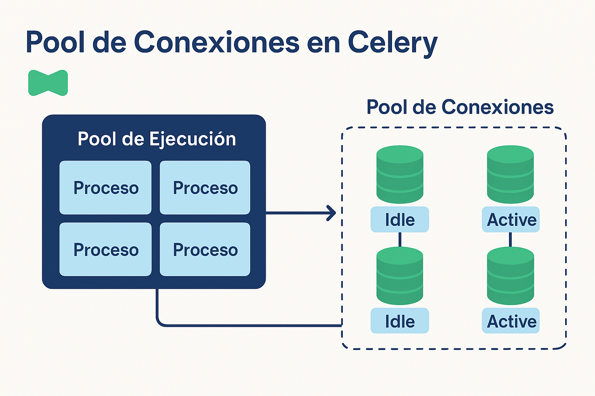

# Pool de Conexiones en Celery

## 📋 Tabla de Contenidos

- [El Pool de Conexiones Explicado](#-el-pool-de-conexiones-explicado)
- [¿Por Qué es Necesario?](#-por-qué-es-necesario)
- [Componentes Clave](#️-componentes-clave)
- [¿Cómo Funciona?](#️-cómo-funciona)
- [Conexión con Celery](#-conexión-con-celery)
- [La Intersección Crítica: Celery y el Pool de Conexiones](#-la-intersección-crítica-celery-y-el-pool-de-conexiones)

---

## 🤝 El Pool de Conexiones Explicado

Un **Pool de Conexiones** (Connection Pool) es un mecanismo de software que se utiliza para **gestionar, reutilizar y compartir** una colección de conexiones de base de datos o de cualquier otro recurso costoso (como conexiones a APIs, a otros servicios, etc.) que se mantienen abiertas y listas para ser utilizadas.

> **💡 Analogía:** Piensa en él como un "carrusel" o una "piscina" de recursos ya creados y verificados.

---

## 💡 ¿Por Qué es Necesario?

Crear y cerrar una conexión a una base de datos es una operación **costosa y lenta** en términos de tiempo de CPU y de latencia de red. Incluye pasos como:

1. **Establecer la conexión de red** - El *handshake* TCP/IP
2. **Autenticación** - Enviar credenciales y verificarlas
3. **Establecer la sesión** - Configurar el entorno
4. **Cerrar y limpiar** - Los recursos al finalizar

> ⚠️ **Impacto:** Si cada vez que tu aplicación (por ejemplo, tu *Celery Worker* o un hilo de tu *Pool de Ejecución*) necesita interactuar con la base de datos, tiene que hacer todo este proceso, el rendimiento se desploma rápidamente bajo carga.

## ⚙️ Componentes Clave

| Componente | Descripción | Analogía |
|------------|-------------|----------|
| **Conexión Idle** (Inactiva) | Una conexión que está abierta y lista en el pool, esperando ser solicitada. | Un taxi esperando en la parada con el motor encendido. |
| **Conexión Active** (Activa) | Una conexión que ha sido "prestada" del pool y está siendo utilizada por un hilo/proceso de la aplicación. | Un taxi que está actualmente llevando a un pasajero. |
| **Tamaño Máximo** (Max Size) | El número máximo total de conexiones que el pool puede abrir. Esto limita la carga en la base de datos. | El número máximo de taxis que pueden estar en la parada. |
| **Timeout** | El tiempo que la aplicación esperará para que una conexión se libere si el pool está lleno. | El tiempo que esperas en la fila si todos los taxis están ocupados. |

---

## 🛠️ ¿Cómo Funciona?

### Ciclo de Vida de una Conexión

1. **Inicio:** Al arrancar la aplicación (o el *Supervisor/Pool* en Celery), el pool inicializa un número mínimo de conexiones.

2. **Solicitud:** Cuando el *Pool de Ejecución* (el proceso que hace la tarea) necesita la base de datos, solicita una conexión al Pool de Conexiones.

3. **Uso:** El Pool le entrega una conexión **Idle** (existente). El hilo la usa, ejecuta la consulta SQL, y termina.

4. **Liberación:** En lugar de **cerrar** la conexión, el hilo la **devuelve** al Pool, que la marca como **Idle** de nuevo, lista para el siguiente solicitante.

---

## 🎯 Conexión con Celery

En el contexto de Celery:

- El **Supervisor** lanza un **Pool de Ejecución** (que puede ser de hilos o procesos)
- Cada tarea ejecutada por un hilo/proceso del **Pool de Ejecución** podría necesitar interactuar con la base de datos
- Si ese *Pool de Ejecución* tiene 4 procesos, y tienes un **Pool de Conexiones** configurado con un tamaño máximo de 4, garantizas que cada proceso del *Worker* tenga una conexión rápida y exclusiva a la base de datos para no bloquearse entre sí
- Si el pool es más pequeño, los procesos de Celery podrían esperar innecesariamente

### Diagrama Visual



---

## 🔗 La Intersección Crítica: Celery y el Pool de Conexiones

Esta es la parte donde la **Anatomía Real** del sistema se vuelve crucial. La relación entre el **Pool de Ejecución de Celery** (los procesos/hilos que hacen el trabajo) y el **Pool de Conexiones de la Base de Datos** (los "puentes" hacia la DB) es la principal causa de *cuellos de botella*.

> 🎯 **Objetivo:** Alcanzar el **Balance Perfecto** donde tu *Worker* de Celery nunca tenga que esperar por una conexión DB, y tu DB nunca sea sobrecargada por demasiadas conexiones concurrentes.

---

### 1. El Pool de Ejecución de Celery (La Demanda)

Celery utiliza el parámetro `concurrency` (o `-c`) para definir el tamaño de su Pool de Ejecución.

- **Procesos Hijos / Hilos:** Cada proceso o hilo lanzado por este Pool que ejecuta una tarea y necesita hablar con la base de datos (**una tarea I/O-bound**), consume **una conexión** de la base de datos.

- **Diferenciación Clave:**
  - Un **Worker** es el proceso supervisor que lanzas con el comando `celery -A <app_name> worker`
  - El **Concurrency** (`-c N`) es el número de **ejecutores simultáneos** que ese *Worker* genera internamente

**Ejemplo de comando:**

```bash
# Lanza 1 Worker con 10 ejecutores concurrentes
celery -A myapp worker -c 10

# Lanza 1 Worker con concurrencia por defecto (número de CPUs)
celery -A myapp worker
```

> 📐 **Principio Clave:** El número total de ejecutores que pueden tocar la DB es:
>
> $$\text{Total Ejecutores} = \text{Número de Workers Lanzados} \times \text{Valor de Concurrency por Worker}$$

### 2. El Pool de Conexiones de la Base de Datos (La Oferta)

Este Pool define el **número máximo** de conexiones que el sistema puede tener abiertas hacia la DB. Es un recurso finito y a menudo el limitador de rendimiento.

### 3. El Desajuste (¡El Problema!)

> ⚠️ El "estallido" ocurre cuando el **Pool de Ejecución de Celery es más grande que el Pool de Conexiones de la DB**.

| Escenario | Consecuencia | Analogía de las Tuberías |
| :--- | :--- | :--- |
| **Pool Celery > Pool DB** | **Bloqueo/Timeouts.** Los ejecutores de Celery se ponen en cola esperando una conexión DB. Si esperan demasiado, la tarea falla por *timeout*. | Tienes muchos grifos abiertos (Ejecutores Celery), pero la tubería principal (Pool DB) solo puede suministrar agua a una fracción. Los procesos se detienen. |
| **Pool Celery < Pool DB** | Recursos Subutilizados. Tienes capacidad ociosa en la DB que Celery no puede aprovechar. Es menos eficiente, pero seguro. | La tubería es ancha, pero solo tienes 2 grifos. Desperdicias la capacidad de la tubería. |
| **Pool Celery = Pool DB** | **Balance Ideal.** Cada ejecutor tiene una conexión garantizada. Máximo rendimiento sin bloqueos por espera de conexión. | El número de grifos coincide con la capacidad de la tubería. |

### 4. La Regla de Oro para el Balance

> 🏆 **Regla de Oro:** Si tus tareas son principalmente **I/O-bound** (DB), la relación debe ser:
>
> $$\text{Total Ejecutores Celery} \le \text{Pool Conexiones DB}$$

#### 📊 Ejemplo Práctico de Distribución

Asumamos que el presupuesto total es de **40 conexiones DB** para Celery.

| Configuración | N. Workers | Concurrency (Por Worker) | Total Ejecutores | Total Conexiones DB |
| :--- | :--- | :--- | :--- | :--- |
| **Opción A (Distribución)** | **4** | `-c 10` | 40 | $4 \times 10 = \mathbf{40}$ |
| **Opción B (Centralizada, NO recomendada)** | **1** | `-c 40` | 40 | $1 \times 40 = \mathbf{40}$ |

---

### 🔑 Por Qué Elegir Múltiples Workers (4 Workers vs. 1 Worker)

Aunque ambas opciones consumen 40 conexiones, la distribución es fundamental para la robustez y escalabilidad:

| Característica | 1 Worker (-c 40) (Centralizado) | 4 Workers (-c 10) (Distribuido) |
| :--- | :--- | :--- |
| **Resiliencia** | **Fallo Único:** Si el *único* proceso Worker falla o se bloquea, **todo el procesamiento se detiene**. | **Aislamiento de Fallas:** Si uno de los 4 Workers falla, **solo pierdes el 25% de tu capacidad**, el resto sigue operando. |
| **Uso de Recursos** | 40 procesos luchando por los núcleos de CPU del sistema operativo pueden generar **sobrecarga de contexto** e ineficiencia. | 4 procesos supervisores son más fáciles de gestionar y distribuir entre núcleos, logrando un mejor rendimiento de la CPU. |
| **Escalabilidad** | Estás limitado a los recursos de la máquina donde reside ese único Worker. | Puedes distribuir los 4 Workers en **máquinas separadas** o contenedores Docker distintos, permitiendo la escalabilidad horizontal y el uso de recursos distribuidos. |

---

En resumen, los **Workers** son las unidades de resiliencia y despliegue (la capa supervisora), mientras que el **Concurrency** define el paralelismo interno (los ejecutores que consumen conexiones).
